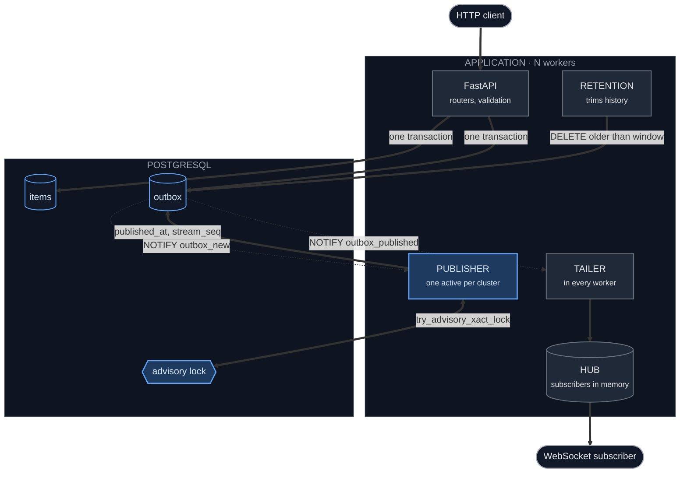
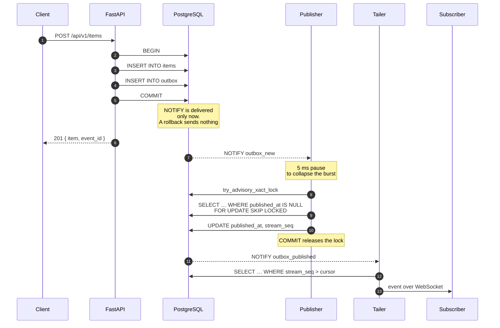
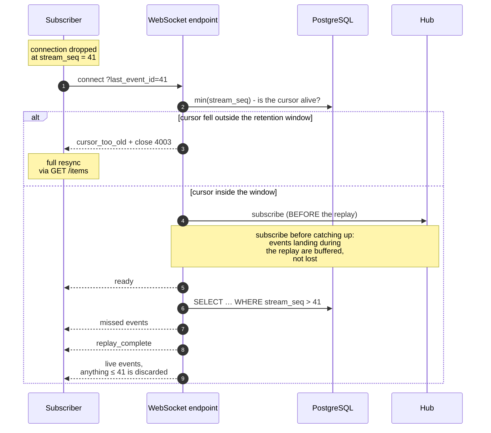
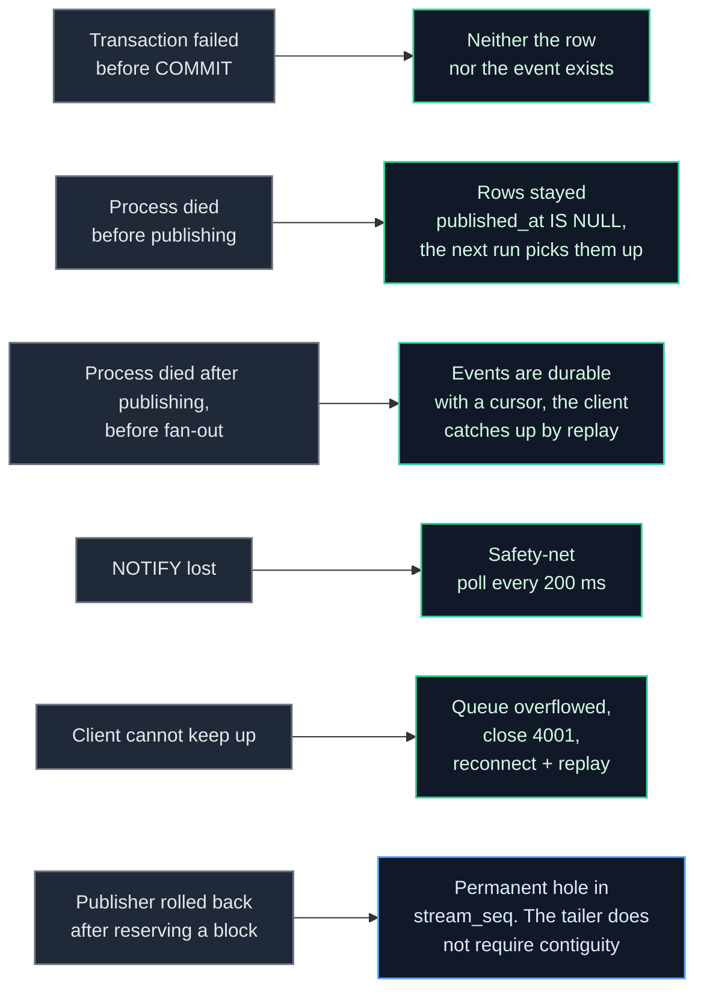
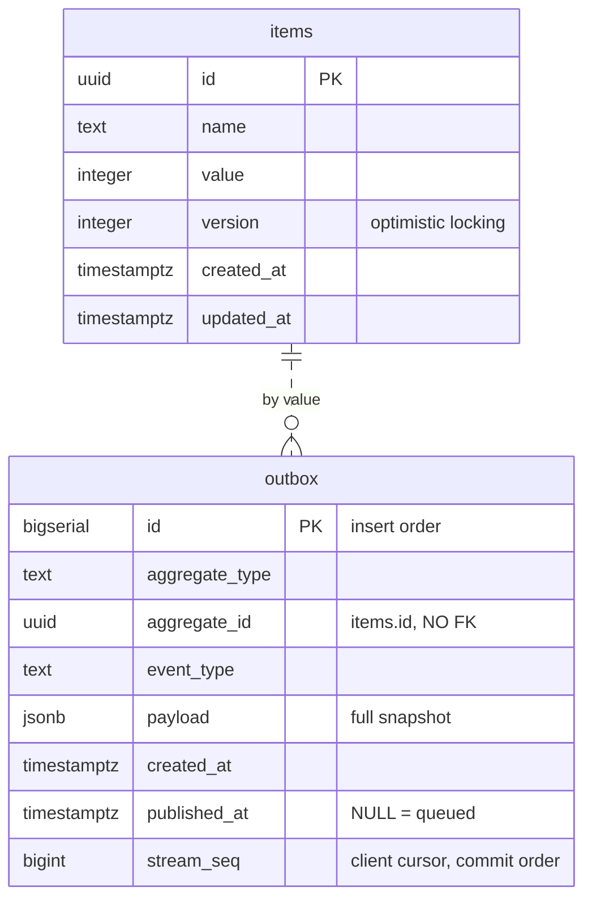
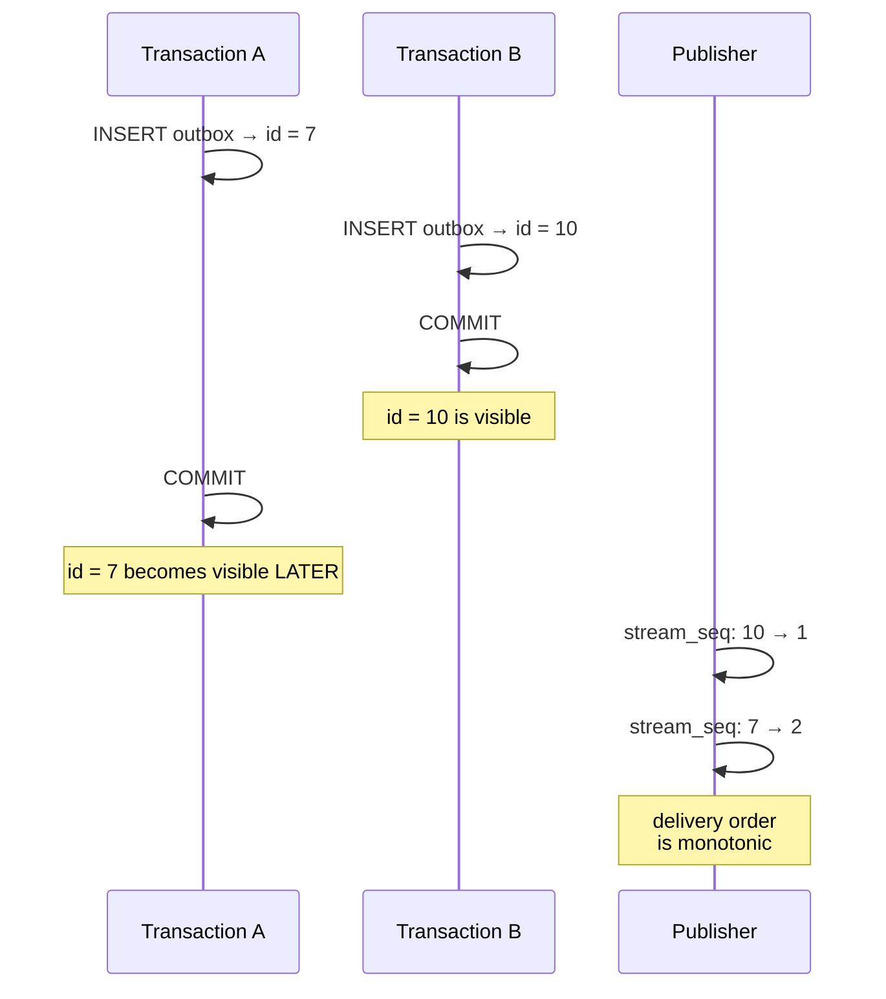

# Architecture

## Overview

The publisher decides the order and runs as a single instance per cluster. The
tailer delivers and runs in every worker. Without that split, events consumed by
one process would only ever reach its own hub.

## Write path

`NOTIFY` is transactional. Postgres queues the notification and delivers it to
listeners only if the transaction committed. A rolled-back one sends nothing.

The publisher reads in a fresh snapshot. Uncommitted rows are simply invisible
to it, so publishing data before its commit is physically impossible.

The lock is held until `COMMIT`, so publisher transactions never overlap, and
the `stream_seq` blocks they hand out commit in the same order they were
reserved. The tailer's cursor relies on that.

## Client reconnect

The order "subscribe first, replay second" is not accidental. The other way
round leaves a window in which an event is already past the replay and not yet
in the subscription. The overlap between the two paths produces duplicates,
which the client discards by cursor; a gap would produce a loss it would not
notice.

## What happens on failure

A green border means nothing is lost. Blue is the one case with a consequence,
and it is harmless: a hole in the sequence does not matter, because the client's
cursor and the tailer's cursor compare "greater than", not "next after".

## Data model

The dashed relation: there is deliberately no foreign key. An `item.deleted`
event has to outlive the row it describes, otherwise a subscriber never learns
about the deletion.

## Why two different identifiers

`outbox.id` is assigned at `INSERT`, before the commit. A client that reached
id = 10 is still owed id = 7 - and a cursor over `id` would silently skip it on
reconnect. This is not a theoretical subtlety but a direct violation of the
reconnection and deduplication requirement.

`stream_seq` is assigned by the publisher after the commit, so it is monotonic
in delivery order - the only order a client can resume from.

`event_id` (which is `outbox.id`) stays in the API as a correlation handle:
`POST` returns it, and the same value arrives in the event, so a client can tie
its own write to the event it produced. It is not a cursor.

## Roles and their resources

| Role | Instances | Connection | What it does |
| --- | --- | --- | --- |
| FastAPI | one per worker | pool (40) | HTTP and WebSocket |
| Publisher | **1 active** per cluster | its own | Assigns `stream_seq` |
| Tailer | one per worker | its own | Reads and fans out to the hub |
| Retention | one per worker | its own | Trims history |

The background roles run on their own connections rather than borrowing from the
request pool. Under a write burst the pool is saturated by the writers
themselves, and a loop queued behind them adds exactly the latency it exists to
remove. Before the split, measurements showed p95 around 700 ms; after it, tens
of milliseconds.

With `APP_WORKERS=4` and `DB_POOL_MAX_SIZE=40` that is 4 × (40 + 3) = 172
connections; compose sets `max_connections=300` on Postgres.
