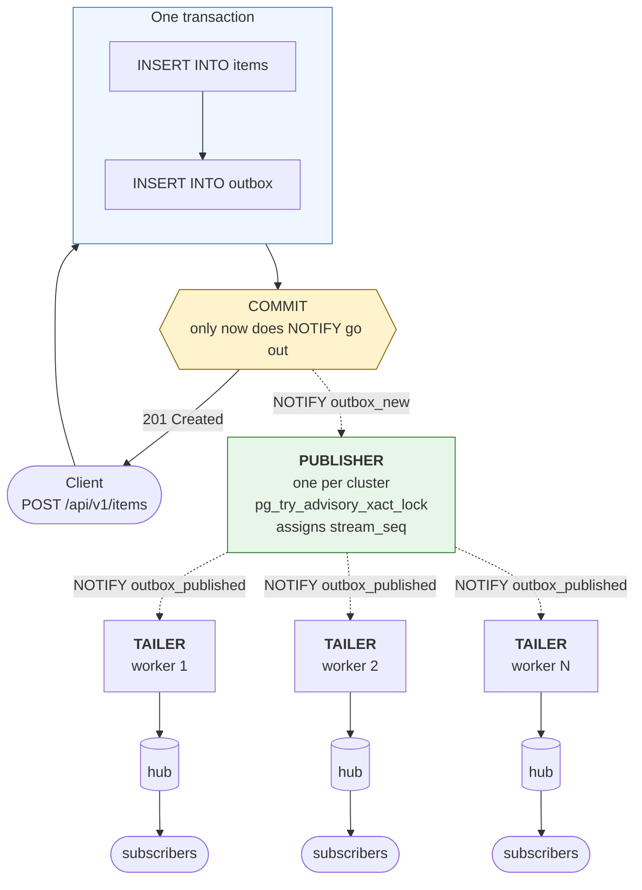

# Transactional Outbox Service

A CRUD API over PostgreSQL that streams committed data changes to connected
clients in real time, with strong consistency between the database state and the
event stream.

Stack: FastAPI, plain `asyncpg` (no ORM on the hot path), the Transactional
Outbox pattern, delivery over WebSocket.

**Contents**

- [Layout](#layout)
- [Running it](#running-it)
- [Three entry points](#three-entry-points)
- [The problem](#the-problem)
- [Consistency guarantees](#consistency-guarantees)
- [API](#api)
- [Event stream](#event-stream)
- [Database schema](#database-schema)
- [Retention](#retention)
- [Tests](#tests)
- [Manual checks](#manual-checks)
- [Load testing](#load-testing)
- [Configuration](#configuration)

## Layout

```
app/
  core/        settings, domain errors, logging
  db/          asyncpg pool, domain records, repository (transactions live here)
  api/         Pydantic schemas, dependencies, HTTP and WebSocket routers
  streaming/   publisher, tailer, hub, retention
migrations/    Alembic, DDL written by hand
tests/         pytest suite: conftest, helpers, six modules
loadtest/      load generator, locustfile
scripts/       entrypoint, check.sh, listen.py, smoke tests
docs/          architecture diagrams, manual check scenarios
```

The split inside `streaming/` is deliberate: the publisher decides the order, the
tailer delivers, the hub holds subscribers and backpressure, retention trims
history. None of them knows about HTTP.

Diagrams - overview, write path, reconnect, behaviour on failure - are in
[docs/ARCHITECTURE.md](docs/ARCHITECTURE.md).

## Running it

Docker is all you need. No `.env` required - every variable in
`docker-compose.yml` has a default.

```bash
docker compose up -d --build --wait
```

`--wait` does not return until the healthcheck goes green, and exits non-zero if
the service failed to come up. Without it `up -d` prints `Started` immediately,
which only means "the process launched", not "ready to serve requests".

Migrations are applied automatically: the container entrypoint waits for the
database, runs `alembic upgrade head`, and only then starts uvicorn.

```bash
curl http://localhost:8000/health
```

### Several workers

```bash
APP_WORKERS=4 docker compose up -d --build --wait
```

Workers do not share memory. Each has its own connection pool, its own
subscriber hub, its own tailer and retention. The publisher is per-worker too,
but only one is ever active - an advisory lock in the database picks it.

The limiting factor is Postgres connections:

```
workers × (DB_POOL_MAX_SIZE + 3) ≤ max_connections
```

The three are publisher, tailer and retention, each on its own connection
outside the pool. With the defaults, `4 × (40 + 3) = 172`; compose sets
`max_connections=300`.

### Locally, without Docker

Requires Python 3.11+ and a running PostgreSQL 13 or newer
(`gen_random_uuid()` is built in from version 13 onwards).

```bash
python -m venv .venv
source .venv/bin/activate
pip install -r requirements-dev.txt

export POSTGRES_HOST=localhost
export POSTGRES_PORT=5432
export POSTGRES_USER=outbox
export POSTGRES_PASSWORD=outbox
export POSTGRES_DB=outbox

alembic upgrade head
uvicorn app.main:app --reload
```

Or bring up only the database from compose and run the application locally:

```bash
docker compose up postgres -d
POSTGRES_HOST=localhost alembic upgrade head
POSTGRES_HOST=localhost uvicorn app.main:app --reload
```

### If the service does not respond

Start here:

```bash
docker compose logs app
docker compose ps
```

`Exited (1)` in the STATUS column means the application died on startup.
`Up (health: starting)` means it is still coming up.

**Incompatible database state.** The `pgdata` volume survives
`docker compose down`. If the database has moved to a migration newer than the
image knows about, `alembic upgrade head` will report
`Can't locate revision identified by '000X'`. From scratch:

```bash
docker compose down -v
docker compose up -d --build --wait
```

**`connection refused` on `alembic upgrade head`.** The database is not up, or
the wrong host is configured. Inside docker-compose the host is `postgres`, from
outside it is `localhost`. Check with `docker compose ps` and
`pg_isready -h localhost -p 5432`.

**`function gen_random_uuid() does not exist`.** Postgres older than 13. Either
upgrade, or run `CREATE EXTENSION IF NOT EXISTS pgcrypto;`.

**`Permission denied` on `./scripts/check.sh`.** The script arrived from git
without the execute bit. Either `bash scripts/check.sh`, or
`chmod +x scripts/check.sh` once.

## Three entry points

### `http://localhost:8000/docs` - Swagger UI

Interactive documentation FastAPI generates from the code: endpoints, request and
response schemas, error codes.

How to make a write:

1. Find the **`POST /api/v1/items`** block
2. Click **`Try it out`**
3. In **Request body** replace `"string"` with the name you want
4. **`Execute`**
5. Under **Responses** you can see code `201`, the body and the `x-event-id` header

For `PATCH` and `DELETE` two fields appear: **item_id** on top - the UUID from
the response - and the request body. To see a version conflict, send `PATCH`
twice with the same `"version": 1` - the second time you get `409`.

Under each endpoint Swagger generates a ready `curl` command that can be copied
into a terminal.

WebSocket will not appear in the list: OpenAPI describes HTTP only.

### `http://localhost:8000/health` - service state

A liveness check for the orchestrator and the main diagnostic endpoint:

```jsonc
{
  "status": "ok",              // overall verdict: ok or degraded
  "database": "ok",            // did Postgres answer SELECT 1
  "worker_pid": 42,            // which worker served this request
  "outbox_pending": 0,         // events written but not published yet
  "stream_head": 10432,        // highest assigned stream_seq (global)
  "tailer_cursor": 10432,      // how far this worker's tailer has read
  "tailer_lag": 0,             // stream_head - tailer_cursor, fan-out lag
  "stream_subscribers": 3,     // WebSocket subscribers on this worker
  "dispatcher_running": true,  // are the publisher and tailer alive
  "retention_running": true    // is the background history trimmer alive
}
```

### `ws://localhost:8000/api/v1/stream` - event stream

```bash
python scripts/listen.py
```

Or from the browser console (`F12` -> Console on any page):

```js
const ws = new WebSocket("ws://localhost:8000/api/v1/stream");
ws.onmessage = (e) => console.log(JSON.parse(e.data));
```

Details are in the [Event stream](#event-stream) section.

## The problem

A naive implementation writes to the database and then publishes to a socket.
That breaks in two places:

| Naive approach | What happens |
| --- | --- |
| Publish before the commit | The transaction rolled back -> clients saw an event for data that does not exist |
| Publish after the commit | The process died between commit and send -> nobody received the committed change |

The outbox removes the gap: the event becomes part of the same transaction as
the data. A separate process then publishes only what has already committed.



Atomicity is provided by PostgreSQL. `NOTIFY` is transactional too: Postgres
delivers the notification to listeners only if the transaction committed. A
rollback sends nothing.

## Consistency guarantees

| Guarantee | How it is achieved |
| --- | --- |
| No event without committed data | The row and the event are in one transaction; a rollback discards both. The publisher reads in a fresh snapshot and does not see uncommitted rows |
| No committed change without an event | The same transaction - the event cannot be lost once the data is durable |
| Ordering within an entity | A write takes `SELECT … FOR UPDATE` on the row **before** inserting into the outbox and holds the lock until commit |
| Global delivery order | `stream_seq` is assigned by the single publisher under an advisory lock, after the commit |
| Replay after reconnect | A cursor over `stream_seq` cannot skip an event that committed "late" |
| Delivery | At-least-once. An event may arrive twice, but it cannot fail to arrive at all |
| Reconnect window | Bounded by retention. A cursor that is too old gets an explicit refusal rather than a truncated history |

## API

| Method | Path | Notes |
| --- | --- | --- |
| `POST` | `/api/v1/items` | Returns the object and `event_id`; also in the `X-Event-Id` header |
| `GET` | `/api/v1/items` | `limit` (1–500), `offset` |
| `GET` | `/api/v1/items/{id}` | |
| `PATCH` | `/api/v1/items/{id}` | Optional `version` field → `409` on mismatch |
| `DELETE` | `/api/v1/items/{id}` | Optional `?version=` |
| `WS` | `/api/v1/stream` | `last_event_id`, `aggregate_id`, `replay` |
| `GET` | `/health` | Outbox depth, tailer lag, subscribers, worker pid |
| `GET` | `/outbox` | Diagnostics: makes the outbox observable |

Errors use a uniform format:

```json
{ "code": "version_conflict", "message": "Item ... has version 3, but version 1 was expected" }
```

## Event stream

### Connection parameters

```
ws://localhost:8000/api/v1/stream
```

| Parameter | Default | What it does |
| --- | --- | --- |
| `last_event_id` | `0` | Resume cursor: the highest `stream_seq` the client has already processed. `0` - live events only, no replay |
| `aggregate_id` | none | Server-side filter to a single entity. Uninteresting events cost no bandwidth |
| `replay` | `true` | `false` - skip the backlog and start from live events |

### Event format

```json
{
  "stream_seq": 42,
  "event_id": 137,
  "event_type": "item.updated",
  "aggregate_type": "item",
  "aggregate_id": "9f1c...",
  "occurred_at": "2026-07-27T10:15:00.123456+00:00",
  "data": {
    "id": "9f1c...",
    "name": "widget",
    "value": 42,
    "version": 3,
    "created_at": "...",
    "updated_at": "..."
  }
}
```

Control frames are distinguished by the presence of a `type` field:

| Frame | When | Meaning |
| --- | --- | --- |
| `{"type": "ready", "resume_from": N}` | right after connecting | The subscription is registered, the server understood the cursor |
| `{"type": "replay_complete", "up_to": N, "count": M}` | after catching up | The backlog has been sent, live stream follows |
| `{"type": "ping"}` | every 30 s of silence | Keeps the connection alive through idle-timeout proxies |
| `{"type": "cursor_too_old", ...}` | cursor fell outside retention | A full resynchronisation is required |

### Client contract

Three rules:

1. Remember the highest `stream_seq` processed.
2. Send it back as `last_event_id` when reconnecting.
3. Discard anything whose `stream_seq` is not greater than the remembered one.

The third rule is mandatory: delivery is at-least-once. An event may arrive
twice, but it cannot fail to arrive at all.

```python
import asyncio, json, websockets

async def consume() -> None:
    cursor = 0
    while True:
        try:
            url = f"ws://localhost:8000/api/v1/stream?last_event_id={cursor}"
            async with websockets.connect(url) as ws:
                async for raw in ws:
                    message = json.loads(raw)
                    if "type" in message:
                        continue
                    if message["stream_seq"] <= cursor:
                        continue
                    handle(message)
                    cursor = message["stream_seq"]
        except websockets.ConnectionClosed:
            await asyncio.sleep(1)

asyncio.run(consume())
```

The cursor is updated after successful processing. If `handle` raises, the event
arrives again on reconnect.

A reference implementation that counts duplicates and gaps is
`scripts/listen.py`.

### Slow client

Every subscriber has a bounded queue (`STREAM_QUEUE_SIZE`, 1000 events by
default). If the client cannot keep up and the queue overflows, the server
closes the connection with code **4001**.

### Close codes

| Code | Reason | What the client should do |
| --- | --- | --- |
| `1000` | Normal closure | Nothing |
| `1012` | Server restarting (sent by uvicorn) | Reconnect with `last_event_id` |
| `4001` | Client could not keep up | Reconnect with `last_event_id` |
| `4002` | Server shutting down | Reconnect with `last_event_id` |
| `4003` | Cursor older than the retention window | Full resync via `GET /api/v1/items` |

`1012` and `4002` mean the same thing. The difference is technical: uvicorn
closes active connections before the application's shutdown hook runs. `1012`
(Service Restart) means "the server is restarting, come back".

### The listener

```bash
python scripts/listen.py                      # live stream
python scripts/listen.py --reconnect          # survives a restart, catches up
python scripts/listen.py --last-event-id 42   # resume from a specific point
python scripts/listen.py --aggregate-id <id>  # a single entity only
```

It behaves like a correct client: remembers the cursor, discards duplicates and
highlights them, shouts `GAP` if a number was skipped.

## Database schema

Entirely in `migrations/versions/`, applied through Alembic. Below is the final
state after three revisions.

### Domain table

```sql
CREATE TABLE items (
    id          UUID        PRIMARY KEY DEFAULT gen_random_uuid(),
    name        TEXT        NOT NULL CHECK (length(name) BETWEEN 1 AND 255),
    value       INTEGER     NOT NULL DEFAULT 0,
    version     INTEGER     NOT NULL DEFAULT 1,
    created_at  TIMESTAMPTZ NOT NULL DEFAULT now(),
    updated_at  TIMESTAMPTZ NOT NULL DEFAULT now()
);

CREATE INDEX ix_items_created_at ON items (created_at DESC, id);
```

`version` grows on every change and is used for optimistic locking: the client
sends the version it saw and gets `409` if the row was modified in the meantime.

### Outbox

```sql
CREATE TABLE outbox (
    id             BIGSERIAL   PRIMARY KEY,
    aggregate_type TEXT        NOT NULL DEFAULT 'item',
    aggregate_id   UUID        NOT NULL,
    event_type     TEXT        NOT NULL
                   CHECK (event_type IN ('item.created', 'item.updated', 'item.deleted')),
    payload        JSONB       NOT NULL,
    created_at     TIMESTAMPTZ NOT NULL DEFAULT clock_timestamp(),
    published_at   TIMESTAMPTZ,
    stream_seq     BIGINT
);

CREATE SEQUENCE outbox_stream_seq AS BIGINT START 1;
```

`id` is the insert order, `stream_seq` is the delivery order.

There is deliberately no foreign key from `aggregate_id` to `items.id`: an
`item.deleted` event has to outlive the row it describes.

### Indexes and constraints

```sql
CREATE INDEX ix_outbox_unpublished
    ON outbox (id)
    WHERE published_at IS NULL;

CREATE INDEX ix_outbox_tail
    ON outbox (stream_seq)
    INCLUDE (id, aggregate_id, event_type)
    WHERE stream_seq IS NOT NULL;

CREATE UNIQUE INDEX ix_outbox_stream_seq
    ON outbox (stream_seq)
    WHERE stream_seq IS NOT NULL;

CREATE INDEX ix_outbox_aggregate ON outbox (aggregate_id, id);

CREATE INDEX ix_outbox_published_at
    ON outbox (published_at)
    WHERE published_at IS NOT NULL;

ALTER TABLE outbox ADD CONSTRAINT ck_outbox_published_has_seq
    CHECK ((published_at IS NULL) = (stream_seq IS NULL));
```

Almost every index is partial:

- `ix_outbox_unpublished` - the publisher's hot path. Stays tiny because
  published rows drop out of the index
- `ix_outbox_tail` - a covering index for the tailer, which scans
  `WHERE stream_seq > cursor` several times a second in every worker
- `ix_outbox_stream_seq` - exists for uniqueness, not for reads.
  Reads have their own index so that dropping the constraint does not silently
  break performance
- `ck_outbox_published_has_seq` - the two fields are set by a single `UPDATE`,
  and it is better for the database to check that than for us to hope

### The commit signal

```sql
CREATE FUNCTION outbox_notify() RETURNS trigger
LANGUAGE plpgsql AS $$
BEGIN
    PERFORM pg_notify('outbox_new', '');
    RETURN NULL;
END;
$$;

CREATE TRIGGER outbox_notify_trigger
    AFTER INSERT ON outbox
    FOR EACH STATEMENT
    EXECUTE FUNCTION outbox_notify();
```

A `STATEMENT`-level trigger with no payload. `NOTIFY` is transactional: Postgres
delivers the notification only on commit, a rolled-back transaction sends
nothing. A second identical trigger on `UPDATE OF stream_seq` sends
`outbox_published` and wakes the tailers in every worker.

## Retention

Published events older than `OUTBOX_RETENTION_HOURS` (24 by default) are removed
in the background, in batches of 5000 with pauses. Unpublished ones are never
touched - they are a work queue, not history. The batches are small on purpose:
one unbounded `DELETE` would hold locks over a large slice of the table and
throttle the publisher.

The retention window is exactly how far back a disconnected client may come back
and catch up. For a client whose cursor fell outside the window, the server says
so directly and closes the connection with code 4003:

```json
{
  "type": "cursor_too_old",
  "requested": 41,
  "oldest_available": 900,
  "detail": "Events after this cursor have been trimmed by retention. ..."
}
```

## Tests

### Running them

Everything at once with a single command:

```bash
bash scripts/check.sh
```

The script stops the `app` container, brings up Postgres, applies the migrations
and runs pytest plus all three smoke suites.
pytest only:

```bash
export POSTGRES_HOST=localhost
python -m pytest
python -m pytest -m "not slow"     # without concurrency and workers
python -m pytest -k reconnect -v   # by name
```

### Where the database comes from

The tests create their own database `<POSTGRES_DB>_test`, apply the migrations to
it and drop it at the end. The working database is never touched. All that is
needed is access to a Postgres server - for example,
`docker compose up -d postgres`.

Before every test the tables are truncated and the `outbox_stream_seq` sequence
is reset. The reset matters: some tests assert absolute cursor values, and
leftovers from a previous test would make them pass or fail for reasons unrelated
to the property under test.

### What is covered

| File | Tests | About |
| --- | --- | --- |
| `test_crud.py` | 15 | All operations, validation, optimistic locking, pagination, health |
| `test_consistency.py` | 8 | Transaction rollback, items/outbox invariants, the delete event outlives the row |
| `test_concurrency.py` | 5 | Concurrent writes, per-entity ordering, the race on version |
| `test_stream.py` | 17 | Live delivery, ordering, replay, deduplication, backpressure, fan-out |
| `test_workers.py` | 6 | Delivery across the worker boundary, a single publisher, per-worker health |
| `test_retention.py` | 6 | History trimming, the reconnect window, refusal on a stale cursor |

The four points named in the assignment are covered as follows:

**Concurrent writes** - `test_concurrent_creates_produce_one_event_each`:
200 simultaneous creates, the number of events must match the number of rows.
Plus `test_optimistic_locking_lets_exactly_one_writer_win`: five clients race
for the same version, exactly one gets 200, the rest get 409.

**Transaction rollback consistency** - `TestRollback`: the transaction fails
after both inserts, before the commit; neither the row nor the event remains.
Separately, `test_rollback_does_not_disturb_a_concurrent_write` - a doomed
transaction must not drag a healthy one down with it.

**Per-entity event ordering** - `test_concurrent_updates_of_one_entity_are_serialised`:
50 concurrent updates of one row produce versions 1..51 with no gaps and no
repeats. And `test_concurrent_writes_to_many_entities_keep_per_entity_order`:
the same while ten entities are worked on at once, so that the order is not
correct merely because nothing else was happening.

**Client reconnection / deduplication** - `TestReconnect`: a drop, writers work
during the offline window, reconnect with the cursor, the replay picks up exactly
what was missed. `test_duplicates_below_the_cursor_are_discarded_by_the_client`
checks the deduplication rule itself rather than assuming it.

### Smoke scripts

```bash
PYTHONPATH=. python scripts/smoke_stage1.py   # 33 checks: writes and outbox
PYTHONPATH=. python scripts/smoke_stage2.py   # 35 checks: event stream
PYTHONPATH=. python scripts/smoke_stage3.py   # 29 checks: two workers, retention
```

The third one starts two independent application instances on different ports -
exactly what `uvicorn --workers 2` does. Otherwise the main property cannot be
proven: a write handled by worker A must reach a subscriber on worker B.

**All three scripts truncate the `items` and `outbox` tables** - do not run them
against a production database.

## Manual checks

Three terminals: `docker compose logs -f app` in the first,
`python scripts/listen.py` in the second, writes via `/docs` or `curl` in the
third.

**An event arrives only after the commit.** Create an object - the event shows up
in the listener practically at the same time as the `201` response, tagged with
something like `+15ms`.

**A rollback produces no event.** Send `{"name": "", "value": 1}` - you get
`422`, and **nothing** in the listener. The rejected write left neither a row nor
an event.

**Ordering within one object.** Create an object and change it five times in
quick succession - six events arrive with versions 1..6, strictly increasing,
with no gaps.

**Reconnect and catch-up.** Note the last number, kill the listener, make five
writes, run `python scripts/listen.py --last-event-id N`. Exactly the five missed
events arrive, then `[replay_complete]`, then the live stream. No `GAP`, no
`DUPLICATE`.

**Automatic reconnect.** Run with `--reconnect` and in another window do
`docker compose restart app` - you will see the drop, the reconnect and the
catch-up.

**Deduplication.** Run with a cursor deliberately lower than the current one -
the replay hands back everything after it. Run a second instance with the same
cursor - it gets exactly the same. That is at-least-once.

### Cross-checking against the database

```bash
psql() { docker compose exec postgres psql -U outbox -d outbox "$@"; }

psql -c "SELECT count(*) FROM outbox WHERE published_at IS NULL"

psql -c "SELECT count(*) FROM items i
         WHERE NOT EXISTS (SELECT 1 FROM outbox o WHERE o.aggregate_id = i.id)"
```

The last one must always return 0: every object has at least one event. If it
does not, consistency is broken, and that is the most important number in the
whole project.

## Load testing

Against a running service, as a separate process:

```bash
python loadtest/run_load.py --writes 5000 --concurrency 1000   # capacity
python loadtest/run_load.py --writes 3000 --rate 200           # latency
```

**Closed loop** (the default) keeps N requests in flight and goes as fast as the
service allows - it measures capacity, and the latency in it is time spent
queueing. **Open loop** (`--rate`) starts requests on a schedule regardless of
whether earlier ones finished - it measures latency at a load the service can
actually sustain.

Every write returns an `event_id`, and the same value arrives in the event - that
gives an exact join between a request and the event it produced, with no guessing
by timestamp.

The publisher, tailer and retention run on their own connections rather than
borrowing from the request pool. Under a burst the pool is saturated by the
writers themselves, and a background loop queued behind them adds exactly the
latency it exists to remove: before the split p95 was around 700 ms, after it,
tens of milliseconds.

| Scenario | commit → delivery p95 | Note |
| --- | --- | --- |
| Steady rate of 15 writes/s | 15 ms | The 500 ms budget beaten thirtyfold |
| 1000 concurrent writes | 5262 ms | Queueing: the rig sustains 111 writes/s |
| 1000 concurrent, database side | 136 ms | insert → publish, within budget |

There is also a Locust profile - `loadtest/locustfile.py`. It measures HTTP only,
because Locust cannot look at a WebSocket, while the main metric of this service
is commit -> delivery.

## Configuration

| Variable | Default | Notes |
| --- | --- | --- |
| `POSTGRES_HOST` / `PORT` / `USER` / `PASSWORD` / `DB` | `postgres` / `5432` / `outbox` × 3 | |
| `DB_POOL_MIN_SIZE` / `MAX_SIZE` | `10` / `40` | The real concurrency limiter for writes. Remember the three connections per worker outside the pool |
| `DB_COMMAND_TIMEOUT` | `10.0` | Seconds |
| `DISPATCHER_BATCH_SIZE` | `256` | Publisher batch size |
| `DISPATCHER_POLL_INTERVAL` | `0.2` | Safety-net poll - the worst-case latency, not the typical one |
| `DISPATCHER_DEBOUNCE` | `0.005` | Pause after `NOTIFY`, collapses a burst into one batch |
| `DISPATCHER_ERROR_BACKOFF` | `1.0` | Pause after an error |
| `TAILER_BATCH_SIZE` / `POLL_INTERVAL` / `DEBOUNCE` | `512` / `0.2` / `0.005` | The same for the tailer |
| `OUTBOX_RETENTION_ENABLED` | `true` | |
| `OUTBOX_RETENTION_HOURS` | `24` | The retention window = the client's reconnect window |
| `OUTBOX_RETENTION_INTERVAL` / `BATCH` | `300.0` / `5000` | Sweep frequency and size |
| `STREAM_QUEUE_SIZE` | `1000` | Subscriber queue; on overflow - code 4001 |
| `STREAM_REPLAY_BATCH_SIZE` | `500` | Page size when catching up |
| `STREAM_HEARTBEAT_INTERVAL` | `30.0` | Ping during silence |
| `APP_WORKERS` | `1` | Number of uvicorn processes |
| `LOG_LEVEL` | `INFO` | |
