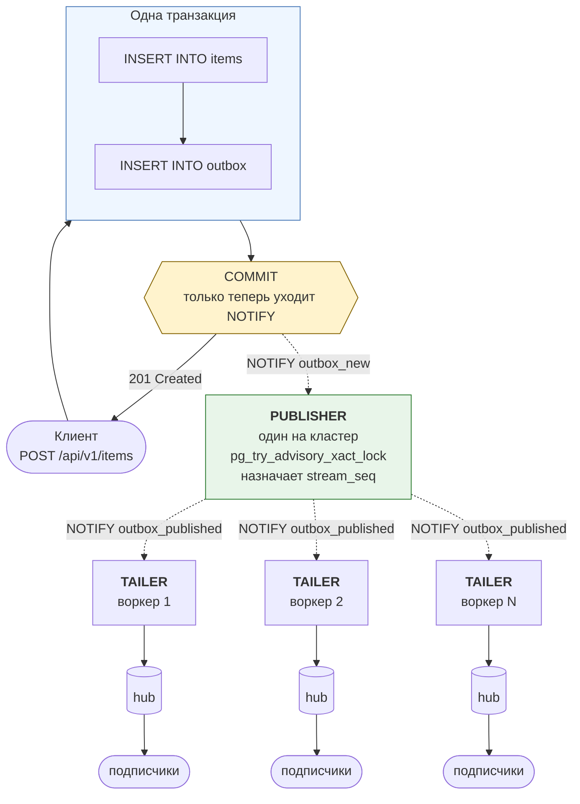

# Transactional Outbox Service

CRUD API над PostgreSQL, которое транслирует закоммиченные изменения данных
подключённым клиентам в реальном времени, с сильной консистентностью между
состоянием БД и потоком событий.

Стек: FastAPI, чистый `asyncpg` (без ORM на горячем пути), паттерн
Transactional Outbox, доставка по WebSocket.

**Содержание**

- [Структура](#структура)
- [Запуск](#запуск)
- [Три точки входа](#три-точки-входа)
- [Задача](#задача)
- [Гарантии консистентности](#гарантии-консистентности)
- [API](#api)
- [Поток событий](#поток-событий)
- [Схема БД](#схема-бд)
- [Retention](#retention)
- [Тесты](#тесты)
- [Ручная проверка](#ручная-проверка)
- [Нагрузочное тестирование](#нагрузочное-тестирование)
- [Конфигурация](#конфигурация)
- [Известные ограничения](#известные-ограничения)

## Структура

```
app/
  core/        настройки, доменные ошибки, логирование
  db/          пул asyncpg, доменные записи, репозиторий (транзакции здесь)
  api/         Pydantic-схемы, зависимости, HTTP- и WebSocket-роутеры
  streaming/   publisher, tailer, hub, retention
migrations/    Alembic, DDL написан вручную
tests/         набор pytest: conftest, helpers, шесть модулей
loadtest/      генератор нагрузки, locustfile
scripts/       entrypoint, check.sh, listen.py, smoke-тесты
```

Разделение внутри `streaming/` намеренное: publisher решает порядок,
tailer доставляет, hub держит подписчиков и backpressure, retention
чистит историю. Ни один из них не знает про HTTP.

## Запуск

Нужен только Docker. `.env` не требуется - у каждой переменной в
`docker-compose.yml` есть значение по умолчанию.

```bash
docker compose up -d --build --wait
```

`--wait` не вернёт управление, пока healthcheck не станет зелёным, и завершится
с ненулевым кодом, если сервис не поднялся. Без него `up -d` печатает `Started`
сразу, а это означает лишь «процесс запущен», но не «готов принимать запросы».

Миграции применяются автоматически: entrypoint контейнера ждёт базу, выполняет
`alembic upgrade head` и только потом запускает uvicorn.

```bash
curl http://localhost:8000/health
```

### Несколько воркеров

```bash
APP_WORKERS=4 docker compose up -d --build --wait
```

Воркеры не разделяют память. У каждого свой пул соединений, свой хаб
подписчиков, свои tailer и retention. Publisher тоже свой, но активен всегда
один - его выбирает advisory-лок в базе.

Ограничитель - соединения к Postgres:

```
воркеров × (DB_POOL_MAX_SIZE + 3) ≤ max_connections
```

Тройка - publisher, tailer и retention, у каждого своё соединение вне пула.
При дефолтах `4 × (40 + 3) = 172`, в compose выставлено `max_connections=300`.

### Локально, без Docker

Нужен Python 3.11+ и запущенный PostgreSQL 13 или новее (`gen_random_uuid()`
входит в ядро начиная с 13-й версии).

```bash
python -m venv .venv
source .venv/bin/activate
pip install -r requirements-dev.txt

export POSTGRES_HOST=localhost
export POSTGRES_PORT=5432
export POSTGRES_USER=outbox
export POSTGRES_PASSWORD=outbox
export POSTGRES_DB=outbox

alembic upgrade head
uvicorn app.main:app --reload
```

Или поднять из compose только базу, а приложение запускать локально:

```bash
docker compose up postgres -d
POSTGRES_HOST=localhost alembic upgrade head
POSTGRES_HOST=localhost uvicorn app.main:app --reload
```

### Если сервис не отвечает

Первым делом:

```bash
docker compose logs app
docker compose ps
```

`Exited (1)` в колонке STATUS означает, что приложение упало на старте.
`Up (health: starting)` - что оно ещё поднимается.

**Несовместимое состояние базы.** Том `pgdata` переживает `docker compose down`.
Если база успела уйти на миграцию новее, чем знает образ, `alembic upgrade head`
сообщит `Can't locate revision identified by '000X'`. Начисто:

```bash
docker compose down -v
docker compose up -d --build --wait
```

**`connection refused` при `alembic upgrade head`.** База не поднялась или
указан не тот хост. Внутри docker-compose хост - `postgres`, снаружи -
`localhost`. Проверить: `docker compose ps` и `pg_isready -h localhost -p 5432`.

**`function gen_random_uuid() does not exist`.** Postgres старее 13-й версии.
Либо обновиться, либо выполнить `CREATE EXTENSION IF NOT EXISTS pgcrypto;`.

**`Permission denied` при `./scripts/check.sh`.** Скрипт приехал из git без бита
исполнения. Либо `bash scripts/check.sh`, либо один раз
`chmod +x scripts/check.sh`.

## Три точки входа

### `http://localhost:8000/docs` - Swagger UI

Интерактивная документация, которую FastAPI генерирует из кода: эндпоинты,
схемы запросов и ответов, коды ошибок. 

Как сделать запись:

1. Найди блок **`POST /api/v1/items`**
2. Нажать **`Try it out`**
3. В **Request body** заменить `"string"` на нужное имя
4. **`Execute`**
5. В **Responses** можно посмотреть код `201`, тело и заголовок `x-event-id`

Для `PATCH` и `DELETE` появятся два поля: **item_id** сверху - туда UUID из
ответа, и тело запроса. Чтобы увидеть конфликт версий, нужно отправить `PATCH` дважды
с одним и тем же `"version": 1` - второй раз получите `409`.

Под каждым эндпоинтом Swagger генерирует готовую команду `curl` - её можно
скопировать в терминал.

WebSocket в списке не появится: OpenAPI описывает только HTTP.

### `http://localhost:8000/health` - состояние сервиса

Проверка живости для оркестратора и главный диагностический эндпоинт:

```jsonc
{
  "status": "ok",              // сводный вердикт: ok или degraded
  "database": "ok",            // ответил ли Postgres на SELECT 1
  "worker_pid": 42,            // какой воркер обслужил этот запрос
  "outbox_pending": 0,         // событий записано, но ещё не опубликовано
  "stream_head": 10432,        // максимальный назначенный stream_seq (глобально)
  "tailer_cursor": 10432,      // до какого места дочитал tailer этого воркера
  "tailer_lag": 0,             // stream_head - tailer_cursor, отставание раздачи
  "stream_subscribers": 3,     // WebSocket-подписчиков на этом воркере
  "dispatcher_running": true,  // живы ли publisher и tailer
  "retention_running": true    // жив ли фоновый чистильщик истории
}
```

### `ws://localhost:8000/api/v1/stream` - поток событий

```bash
python scripts/listen.py
```

Или из консоли браузера (`F12` -> Console на любой странице):

```js
const ws = new WebSocket("ws://localhost:8000/api/v1/stream");
ws.onmessage = (e) => console.log(JSON.parse(e.data));
```

Подробности - в разделе [Поток событий](#поток-событий).

## Задача

Наивная реализация пишет в БД, а потом публикует в сокет. Это ломается в двух
местах:

| Наивный подход | Что происходит |
| --- | --- |
| Публикация до коммита | Транзакция откатилась -> клиенты увидели событие о данных, которых нет |
| Публикация после коммита | Процесс умер между коммитом и отправкой -> закоммиченное изменение никто не получил |

Outbox убирает разрыв: событие становится частью той же транзакции, что и
данные. Дальше отдельный процесс публикует только то, что уже закоммичено.



Атомарность обеспечивает PostgreSQL. `NOTIFY` тоже
транзакционен: Postgres доставляет уведомление слушателям, только если
транзакция закоммитилась. Откат не шлёт ничего.

## Гарантии консистентности

| Гарантия | Чем обеспечена |
| --- | --- |
| Нет события без закоммиченных данных | Строка и событие в одной транзакции; откат отменяет оба. Publisher читает в свежем снапшоте и незакоммиченного не видит |
| Нет закоммиченного изменения без события | Та же транзакция - событие невозможно потерять, если данные durable |
| Порядок внутри сущности | Запись берёт `SELECT … FOR UPDATE` по строке **до** вставки в outbox и держит блокировку до коммита |
| Глобальный порядок доставки | `stream_seq` назначает единственный publisher под advisory-локом, после коммита |
| Реплей после реконнекта | Курсор по `stream_seq` не может пропустить событие, закоммиченное «поздно» |
| Доставка | At-least-once. Событие может прийти дважды, но не может не прийти ни разу |
| Окно реконнекта | Ограничено retention. Слишком старый курсор получает явный отказ, а не урезанную историю |

## API

| Метод | Путь | Примечание |
| --- | --- | --- |
| `POST` | `/api/v1/items` | Возвращает объект и `event_id`; он же в заголовке `X-Event-Id` |
| `GET` | `/api/v1/items` | `limit` (1–500), `offset` |
| `GET` | `/api/v1/items/{id}` | |
| `PATCH` | `/api/v1/items/{id}` | Необязательное поле `version` → `409` при расхождении |
| `DELETE` | `/api/v1/items/{id}` | Необязательный `?version=` |
| `WS` | `/api/v1/stream` | `last_event_id`, `aggregate_id`, `replay` |
| `GET` | `/health` | Глубина outbox, отставание tailer'а, подписчики, pid воркера |
| `GET` | `/outbox` | Диагностика: делает outbox наблюдаемым |

Ошибки в едином формате:

```json
{ "code": "version_conflict", "message": "Item ... has version 3, but version 1 was expected" }
```

## Поток событий

### Параметры подключения

```
ws://localhost:8000/api/v1/stream
```

| Параметр | По умолчанию | Что делает |
| --- | --- | --- |
| `last_event_id` | `0` | Курсор возобновления: наибольший `stream_seq`, который клиент уже обработал. `0` - только живые события, без реплея |
| `aggregate_id` | нет | Серверный фильтр по одной сущности. Неинтересные события не тратят трафик |
| `replay` | `true` | `false` - пропустить накопленное и начать сразу с живых событий |

### Формат события

```json
{
  "stream_seq": 42,
  "event_id": 137,
  "event_type": "item.updated",
  "aggregate_type": "item",
  "aggregate_id": "9f1c...",
  "occurred_at": "2026-07-27T10:15:00.123456+00:00",
  "data": {
    "id": "9f1c...",
    "name": "widget",
    "value": 42,
    "version": 3,
    "created_at": "...",
    "updated_at": "..."
  }
}
```

Служебные кадры отличаются наличием поля `type`:

| Кадр | Когда | Смысл |
| --- | --- | --- |
| `{"type": "ready", "resume_from": N}` | сразу после подключения | Подписка оформлена, сервер понял курсор |
| `{"type": "replay_complete", "up_to": N, "count": M}` | после догона | Пропущенное отправлено, дальше живой поток |
| `{"type": "ping"}` | каждые 30 с тишины | Держит соединение сквозь прокси с idle-таймаутом |
| `{"type": "cursor_too_old", ...}` | курсор выпал за retention | Нужна полная ресинхронизация |

### Контракт клиента

Три правила:

1. Запоминать наибольший обработанный `stream_seq`.
2. При переподключении отправлять его как `last_event_id`.
3. Отбрасывать всё, у чего `stream_seq` не больше запомненного.

Третий пункт обязателен: доставка at-least-once. Событие может прийти дважды,
но не может не прийти ни разу.

```python
import asyncio, json, websockets

async def consume() -> None:
    cursor = 0
    while True:
        try:
            url = f"ws://localhost:8000/api/v1/stream?last_event_id={cursor}"
            async with websockets.connect(url) as ws:
                async for raw in ws:
                    message = json.loads(raw)
                    if "type" in message:
                        continue
                    if message["stream_seq"] <= cursor:
                        continue
                    handle(message)
                    cursor = message["stream_seq"]
        except websockets.ConnectionClosed:
            await asyncio.sleep(1)

asyncio.run(consume())
```

Курсор обновляется после успешной обработки. Если `handle` упадёт,
при переподключении событие придёт заново.

Референсная реализация с подсчётом дубликатов и пропусков - `scripts/listen.py`.

### Медленный клиент

У каждого подписчика ограниченная очередь (`STREAM_QUEUE_SIZE`, по умолчанию
1000 событий). Если клиент не успевает вычитывать и очередь переполняется,
сервер закрывает соединение с кодом **4001**.

### Коды закрытия

| Код | Причина | Что делать клиенту |
| --- | --- | --- |
| `1000` | Нормальное закрытие | Ничего |
| `1012` | Сервер перезапускается (шлёт uvicorn) | Переподключиться с `last_event_id` |
| `4001` | Клиент не успевал вычитывать | Переподключиться с `last_event_id` |
| `4002` | Сервер выключается | Переподключиться с `last_event_id` |
| `4003` | Курсор старше окна retention | Полный resync через `GET /api/v1/items` |

`1012` и `4002` означают одно и то же. Разница техническая: uvicorn закрывает
активные соединения раньше, чем отрабатывает shutdown-хук приложения. `1012`
(Service Restart) означает «сервер перезапускается, возвращайтесь».

### Слушатель

```bash
python scripts/listen.py                      # живой поток
python scripts/listen.py --reconnect          # переживает restart, догоняет
python scripts/listen.py --last-event-id 42   # продолжить с конкретного места
python scripts/listen.py --aggregate-id <id>  # только одна сущность
```

Ведёт себя как корректный клиент: помнит курсор, отбрасывает дубликаты и
подсвечивает их, кричит `GAP`, если номер пропущен.

## Схема БД

Полностью в `migrations/versions/`, применяется через Alembic. Здесь - итоговое
состояние после трёх ревизий.

### Доменная таблица

```sql
CREATE TABLE items (
    id          UUID        PRIMARY KEY DEFAULT gen_random_uuid(),
    name        TEXT        NOT NULL CHECK (length(name) BETWEEN 1 AND 255),
    value       INTEGER     NOT NULL DEFAULT 0,
    version     INTEGER     NOT NULL DEFAULT 1,
    created_at  TIMESTAMPTZ NOT NULL DEFAULT now(),
    updated_at  TIMESTAMPTZ NOT NULL DEFAULT now()
);

CREATE INDEX ix_items_created_at ON items (created_at DESC, id);
```

`version` растёт при каждом изменении и используется для оптимистичной
блокировки: клиент присылает версию, которую видел, и получает `409`, если
строку успели изменить.

### Outbox

```sql
CREATE TABLE outbox (
    id             BIGSERIAL   PRIMARY KEY,
    aggregate_type TEXT        NOT NULL DEFAULT 'item',
    aggregate_id   UUID        NOT NULL,
    event_type     TEXT        NOT NULL
                   CHECK (event_type IN ('item.created', 'item.updated', 'item.deleted')),
    payload        JSONB       NOT NULL,
    created_at     TIMESTAMPTZ NOT NULL DEFAULT clock_timestamp(),
    published_at   TIMESTAMPTZ,
    stream_seq     BIGINT
);

CREATE SEQUENCE outbox_stream_seq AS BIGINT START 1;
```

`id` - порядок вставки, `stream_seq` - порядок доставки.

Внешнего ключа из `aggregate_id` в `items.id` нет намеренно: событие
`item.deleted` обязано пережить строку, о которой рассказывает.

### Индексы и констрейнты

```sql
CREATE INDEX ix_outbox_unpublished
    ON outbox (id)
    WHERE published_at IS NULL;

CREATE INDEX ix_outbox_tail
    ON outbox (stream_seq)
    INCLUDE (id, aggregate_id, event_type)
    WHERE stream_seq IS NOT NULL;

CREATE UNIQUE INDEX ix_outbox_stream_seq
    ON outbox (stream_seq)
    WHERE stream_seq IS NOT NULL;

CREATE INDEX ix_outbox_aggregate ON outbox (aggregate_id, id);

CREATE INDEX ix_outbox_published_at
    ON outbox (published_at)
    WHERE published_at IS NOT NULL;

ALTER TABLE outbox ADD CONSTRAINT ck_outbox_published_has_seq
    CHECK ((published_at IS NULL) = (stream_seq IS NULL));
```

Почти все индексы партиальные:

- `ix_outbox_unpublished` - горячий путь publisher'а. Остаётся крошечным,
  потому что опубликованные строки выпадают из индекса
- `ix_outbox_tail` - covering-индекс для tailer'а, он сканирует
  `WHERE stream_seq > cursor` несколько раз в секунду в каждом воркере
- `ix_outbox_stream_seq` - существует ради уникальности, а не ради чтения
  У чтения свой индекс, чтобы снятие констрейнта не сломало производительность
  молча
- `ck_outbox_published_has_seq` - два поля ставятся одним `UPDATE`, и пусть
  база это проверяет, чем мы будем надеяться

### Сигнал о коммите

```sql
CREATE FUNCTION outbox_notify() RETURNS trigger
LANGUAGE plpgsql AS $$
BEGIN
    PERFORM pg_notify('outbox_new', '');
    RETURN NULL;
END;
$$;

CREATE TRIGGER outbox_notify_trigger
    AFTER INSERT ON outbox
    FOR EACH STATEMENT
    EXECUTE FUNCTION outbox_notify();
```

Триггер уровня `STATEMENT` и без payload. `NOTIFY` транзакционен: Postgres
доставит уведомление только при коммите, откатившаяся транзакция не пошлёт
ничего. Второй такой же триггер на `UPDATE OF stream_seq` шлёт
`outbox_published` и будит tailer'ы во всех воркерах.

## Retention

Опубликованные события старше `OUTBOX_RETENTION_HOURS` (по умолчанию 24)
удаляются фоном, батчами по 5000 с паузами. Неопубликованные не трогаются
никогда - это рабочая очередь, а не история. Батчи маленькие намеренно: один
безлимитный `DELETE` держал бы блокировки на большом куске таблицы и тормозил
publisher.

Окно retention - оно ровно настолько,
насколько назад отключившийся клиент может вернуться и догнать. Клиенту, чей
курсор выпал за окно, сервер говорит прямо и закрывает соединение кодом 4003:

```json
{
  "type": "cursor_too_old",
  "requested": 41,
  "oldest_available": 900,
  "detail": "Events after this cursor have been trimmed by retention. ..."
}
```

## Тесты

### Запуск

Одной командой всё сразу:

```bash
bash scripts/check.sh
```

Скрипт останавливает контейнер `app`, поднимает Postgres, накатывает миграции и
прогоняет pytest плюс все три smoke-набора.
Только pytest:

```bash
export POSTGRES_HOST=localhost
python -m pytest
python -m pytest -m "not slow"     # без конкурентности и воркеров
python -m pytest -k reconnect -v   # по имени
```

### Откуда берётся база

Тесты создают собственную базу `<POSTGRES_DB>_test`, накатывают на неё миграции
и удаляют в конце. Рабочая база не трогается. Нужен только доступ к серверу
Postgres - например, `docker compose up -d postgres`.

Перед каждым тестом таблицы очищаются, а последовательность `outbox_stream_seq`
сбрасывается. Сброс важен: часть тестов проверяет абсолютные значения курсора, и
остатки от предыдущего теста делали бы их зелёными или красными по причинам, к
проверяемому свойству не относящимся.

### Что покрыто

| Файл | Тестов | О чём |
| --- | --- | --- |
| `test_crud.py` | 15 | Все операции, валидация, оптимистичная блокировка, пагинация, health |
| `test_consistency.py` | 8 | Откат транзакции, инварианты items/outbox, событие удаления переживает строку |
| `test_concurrency.py` | 5 | Параллельные записи, порядок внутри сущности, гонка на версии |
| `test_stream.py` | 17 | Живая доставка, порядок, реплей, дедупликация, backpressure, fan-out |
| `test_workers.py` | 6 | Доставка через границу воркеров, единственный publisher, per-worker health |
| `test_retention.py` | 6 | Чистка истории, окно реконнекта, отказ по устаревшему курсору |

Четыре пункта, названные в ТЗ, покрыты так:

**Concurrent writes** - `test_concurrent_creates_produce_one_event_each`:
200 одновременных созданий, число событий обязано совпасть с числом строк.
Плюс `test_optimistic_locking_lets_exactly_one_writer_win`: пять клиентов
гонятся за одну версию, ровно один получает 200, остальные 409.

**Transaction rollback consistency** - `TestRollback`: транзакция падает после
обеих вставок, до коммита; ни строки, ни события не остаётся. Отдельно
`test_rollback_does_not_disturb_a_concurrent_write` - обречённая транзакция не
должна утащить за собой здоровую.

**Per-entity event ordering** - `test_concurrent_updates_of_one_entity_are_serialised`:
50 параллельных апдейтов одной строки дают версии 1..51 без пропусков и
повторов. И `test_concurrent_writes_to_many_entities_keep_per_entity_order`:
то же при одновременной работе с десятью сущностями, чтобы порядок не оказался
верным просто потому, что больше ничего не происходило.

**Client reconnection / deduplication** - `TestReconnect`: разрыв, писатели
работают в offline-окно, переподключение с курсором, реплей добирает ровно
пропущенное. `test_duplicates_below_the_cursor_are_discarded_by_the_client`
проверяет само правило дедупликации, а не предполагает его.

### Smoke-скрипты

```bash
PYTHONPATH=. python scripts/smoke_stage1.py   # 33 проверки: запись и outbox
PYTHONPATH=. python scripts/smoke_stage2.py   # 35 проверок: поток событий
PYTHONPATH=. python scripts/smoke_stage3.py   # 29 проверок: два воркера, retention
```

Третий поднимает два независимых экземпляра приложения на разных портах -
ровно то, что делает `uvicorn --workers 2`. Иначе главное свойство не доказать:
запись, обработанная воркером A, обязана дойти до подписчика воркера B.

**Все три скрипта очищают таблицы `items` и `outbox`** - на боевой базе не
запускать.

## Ручная проверка

Три терминала: в первом `docker compose logs -f app`, во втором
`python scripts/listen.py`, в третьем записи через `/docs` или `curl`.

**Событие приходит только после коммита.** Создать объект - событие появится в
слушателе практически одновременно с ответом `201`, с пометкой вроде `+15ms`.

**Откат не порождает событие.** Отправь `{"name": "", "value": 1}` - получишь
`422`, а в слушателе **ничего**. Отклонённая запись не оставила ни строки, ни
события.

**Порядок по одному объекту.** Создай объект и быстро измени пять раз - придут
шесть событий с версиями 1..6, строго по возрастанию, без пропусков.

**Реконнект и догон.** Запомни последний номер, прибей слушателя, сделай пять
записей, запусти `python scripts/listen.py --last-event-id N`. Придут ровно
пять пропущенных, потом `[replay_complete]`, дальше живой поток. Ни `GAP`, ни
`DUPLICATE`.

**Автоматический реконнект.** Запусти с `--reconnect` и в другом окне сделай
`docker compose restart app` - увидишь разрыв, переподключение и догон.

**Дедупликация.** Запусти с курсором заведомо меньше текущего - реплей выдаст
всё после него. Запусти второй экземпляр с тем же курсором - получит то же
самое. Это и есть at-least-once.

### Сверка с базой

```bash
psql() { docker compose exec postgres psql -U outbox -d outbox "$@"; }

psql -c "SELECT count(*) FROM outbox WHERE published_at IS NULL"

psql -c "SELECT count(*) FROM items i
         WHERE NOT EXISTS (SELECT 1 FROM outbox o WHERE o.aggregate_id = i.id)"
```

Последний должен всегда возвращать 0: у каждого объекта есть хотя бы одно
событие. Если нет - консистентность нарушена, и это самое важное число во всём
проекте.

## Нагрузочное тестирование

На запущенном сервисе, отдельным процессом:

```bash
python loadtest/run_load.py --writes 5000 --concurrency 1000   # ёмкость
python loadtest/run_load.py --writes 3000 --rate 200           # латентность
```

**Closed loop** (по умолчанию) держит N запросов в полёте и идёт так быстро, как позволяет сервис - меряет
ёмкость, а латентность в нём это время в очереди. **Open loop** (`--rate`)
стартует запросы по расписанию независимо от того, завершились ли предыдущие -
меряет латентность при нагрузке, которую сервис реально тянет.

Каждая запись возвращает `event_id`, и то же значение приходит в событии - это
даёт точную стыковку запроса с порождённым им событием, без угадывания по
времени.

Publisher, tailer и retention работают на собственных соединениях, а не
берут их из пула запросов. Под всплеском пул занят самими писателями, и фоновый
цикл в очереди за ними добавляет ровно ту задержку, ради устранения которой
существует: до разделения p95 был около 700 мс, после - десятки миллисекунд.

| Сценарий | commit → доставка p95 | Примечание |
| --- | --- | --- |
| Устойчивый темп 15 записей/с | 15 мс | Бюджет 500 мс перекрыт в 30 раз |
| 1000 одновременных записей | 5262 мс | Очередь: стенд держит 111 записей/с |
| 1000 одновременных, сторона БД | 136 мс | insert → публикация, в бюджете |

Есть и профиль для Locust - `loadtest/locustfile.py`. Он меряет только HTTP,
потому что Locust не умеет смотреть на WebSocket, а главная метрика этого
сервиса - commit -> доставка.

## Конфигурация

| Переменная | По умолчанию | Примечание |
| --- | --- | --- |
| `POSTGRES_HOST` / `PORT` / `USER` / `PASSWORD` / `DB` | `postgres` / `5432` / `outbox` × 3 | |
| `DB_POOL_MIN_SIZE` / `MAX_SIZE` | `10` / `40` | Ограничитель конкурентности записей. Помнить про три соединения на воркер вне пула |
| `DB_COMMAND_TIMEOUT` | `10.0` | Секунды |
| `DISPATCHER_BATCH_SIZE` | `256` | Размер пачки publisher'а |
| `DISPATCHER_POLL_INTERVAL` | `0.2` | Страховочный поллинг - худший случай задержки, не типичный |
| `DISPATCHER_DEBOUNCE` | `0.005` | Пауза после `NOTIFY`, схлопывает пачку в один батч |
| `DISPATCHER_ERROR_BACKOFF` | `1.0` | Пауза после ошибки |
| `TAILER_BATCH_SIZE` / `POLL_INTERVAL` / `DEBOUNCE` | `512` / `0.2` / `0.005` | То же для tailer'а |
| `OUTBOX_RETENTION_ENABLED` | `true` | |
| `OUTBOX_RETENTION_HOURS` | `24` | Окно хранения = окно реконнекта клиента |
| `OUTBOX_RETENTION_INTERVAL` / `BATCH` | `300.0` / `5000` | Частота и размер сметания |
| `STREAM_QUEUE_SIZE` | `1000` | Очередь подписчика; переполнилась - код 4001 |
| `STREAM_REPLAY_BATCH_SIZE` | `500` | Размер страницы при догоне |
| `STREAM_HEARTBEAT_INTERVAL` | `30.0` | Пинг в тишине |
| `APP_WORKERS` | `1` | Число процессов uvicorn |
| `LOG_LEVEL` | `INFO` | |
