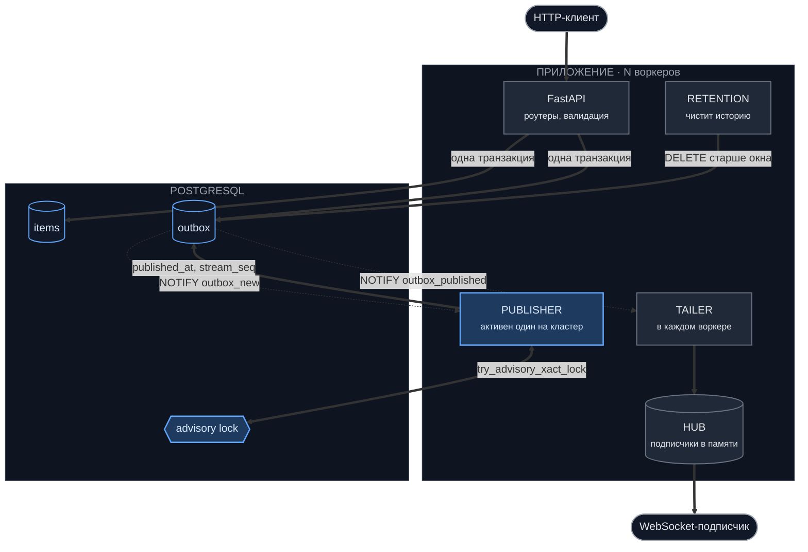
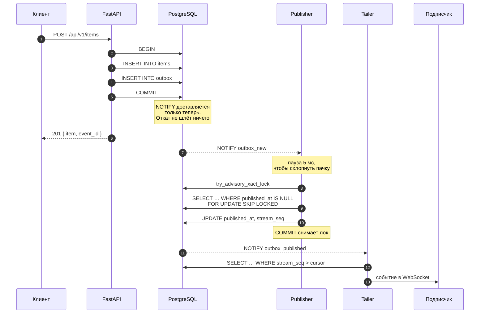
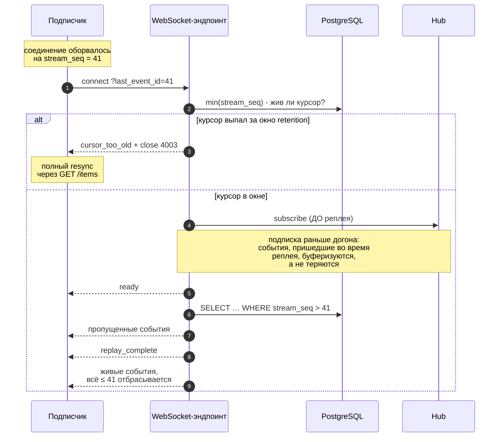
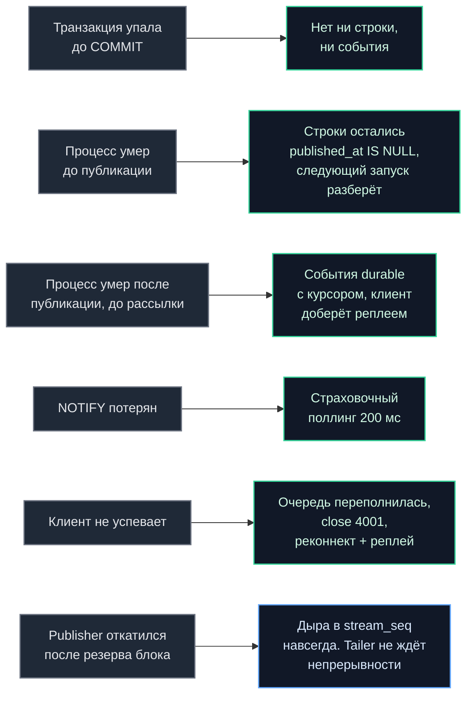
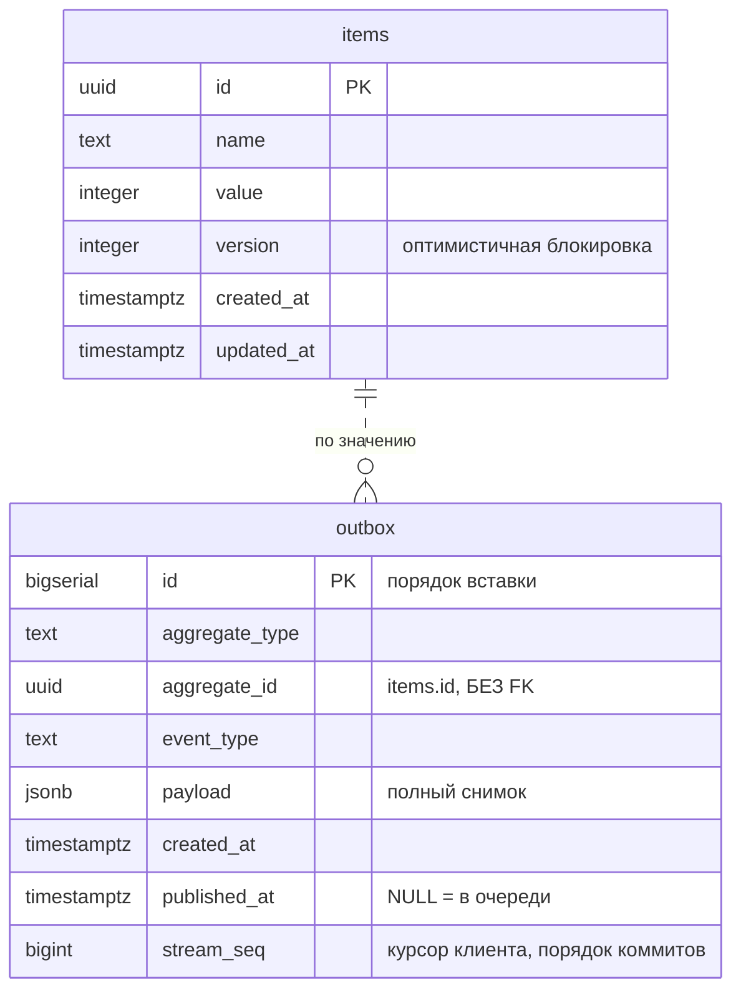
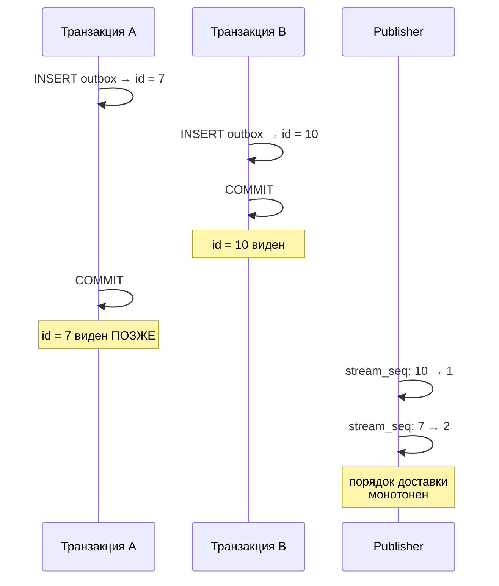

# Архитектура

## Общая картина

Publisher решает порядок и работает в одном экземпляре на кластер. Tailer доставляет и работает
в каждом воркере. Без такого разделения события, разобранные одним процессом,
попадали бы только в его собственный хаб.

## Путь записи

`NOTIFY` транзакционен. Postgres кладёт уведомление в очередь и
доставляет слушателям, только если транзакция закоммитилась. Откатившаяся не
шлёт ничего.

Publisher читает в свежем снапшоте. Незакоммиченные строки ему
попросту не видны, поэтому опубликовать данные раньше их коммита физически
невозможно.

Лок держится до `COMMIT`, поэтому транзакции publisher'ов не
пересекаются, и выданные ими блоки `stream_seq` коммитятся в том же порядке, в
каком были зарезервированы. На это опирается курсор tailer'а.

## Реконнект клиента

Порядок «сначала подписка, потом реплей» неслучаен. Наоборот было бы окно, в
котором событие уже не попало в реплей и ещё не попало в подписку. Пересечение
двух путей даёт дубликаты, которые клиент отбрасывает по курсору; разрыв дал бы
потерю, которую он не заметил бы.

## Что произойдёт при сбое

Зелёная рамка - потерь нет. Синяя - единственный случай с последствием, и оно
безвредно: дыра в последовательности не мешает, потому что курсор клиента и
курсор tailer'а сравнивают «больше чем», а не «следующий за».

## Схема данных

Связь пунктиром: внешнего ключа нет намеренно. Событие `item.deleted` обязано
пережить строку, о которой рассказывает, - иначе подписчик не узнает об
удалении.

## Почему два разных идентификатора

`outbox.id` выдаётся при `INSERT`, до коммита. Клиент, дошедший до id = 10, всё
ещё должен получить id = 7 - а курсор по `id` при реконнекте молча бы его
пропустил. Это не теоретическая тонкость, а прямое нарушение требования про
reconnection и deduplication.

`stream_seq` присваивает publisher после коммита, поэтому он монотонен в
порядке доставки - единственном порядке, с которого клиент может продолжить.

`event_id` (он же `outbox.id`) остаётся в API как ручка корреляции: `POST`
возвращает его, и то же значение приходит в событии, так что клиент может
связать свою запись с её событием. Курсором он не является.

## Роли и их ресурсы

| Роль | Экземпляров | Соединение | Что делает |
| --- | --- | --- | --- |
| FastAPI | по числу воркеров | пул (40) | HTTP и WebSocket |
| Publisher | **1 активный** на кластер | своё | Назначает `stream_seq` |
| Tailer | по числу воркеров | своё | Читает и раздаёт в хаб |
| Retention | по числу воркеров | своё | Чистит историю |

Фоновые роли работают на собственных соединениях, а не берут их из пула
запросов. Под всплеском записей пул занят самими писателями, и цикл в очереди
за ними добавляет ровно ту задержку, ради устранения которой существует. До
разделения замеры показывали p95 около 700 мс, после - десятки миллисекунд.

При `APP_WORKERS=4` и `DB_POOL_MAX_SIZE=40` это 4 × (40 + 3) = 172 соединения;
в compose у Postgres выставлено `max_connections=300`.
